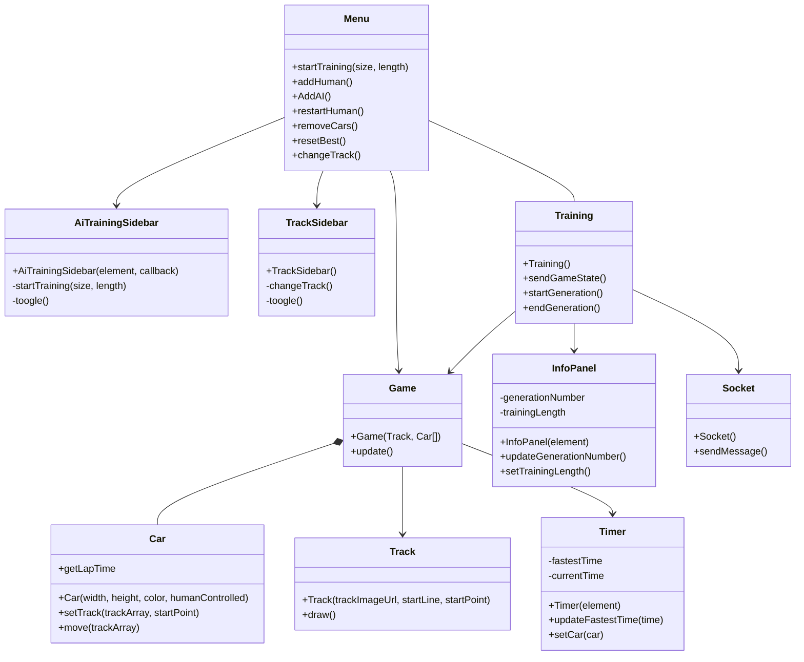

# CLASS DIAGRAM

```mermaid
classDiagram
    class Game {
        +Game(Track, Car[])
        +update()
    }

    class Timer {
        -fastestTime
        -currentTime
        +Timer(element)
        +updateFastestTime(time)
        +setCar(car)
    }

    class Car {
        +Car(width, height, color, humanControlled)
        +setTrack(trackArray, startPoint)
        +move(trackArray)
        +getLapTime
    }

    class Menu {
        +startTraining(size, length)
        +addHuman()
        +AddAI()
        +restartHuman()
        +removeCars()
        +resetBest()
        +changeTrack()
    }

    class AiTrainingSidebar {
        +AiTrainingSidebar(element, callback)
        -startTraining(size, length)
        -toogle()
    }

    class TrackSidebar {
        +TrackSidebar()
        -changeTrack()
        -toogle()
    }

    class Track {
        +Track(trackImageUrl, startLine, startPoint)
        +draw()
    }

    class Training {
        +Training()
        +sendGameState()
        +startGeneration()
        +endGeneration()
    }

    class InfoPanel {
        +InfoPanel(element)
        -generationNumber
        -trainingLength
        +updateGenerationNumber()
        +setTrainingLength()
    }

    class Socket {
        +Socket()
        +sendMessage()
    }

    Game *-- Car
    Game --> Track
    Game --> Timer
    Menu -- Training
    Menu --> TrackSidebar
    Menu --> AiTrainingSidebar
    Menu --> Game
    Training --> InfoPanel
    Training --> Game
    Training --> Socket
```
